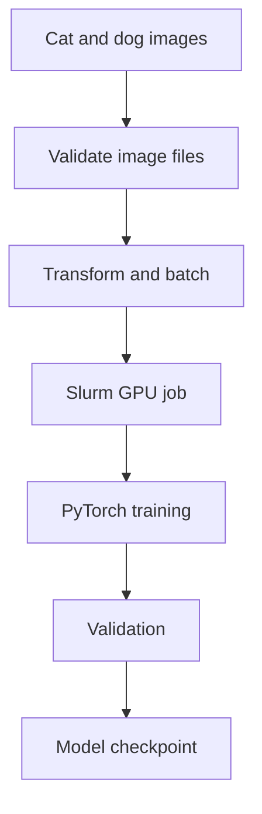

# GPU CNN Training on a Slurm HPC Cluster

A compact PyTorch workflow for training and validating a convolutional neural network on a university GPU cluster managed by Slurm.

The project demonstrates the complete mechanics of moving an image-classification experiment from a local script to scheduled CUDA execution: dataset validation, preprocessing, model definition, device transfer, training, validation, checkpointing, environment verification, and batch-job submission.

The experiment intentionally uses a small, balanced subset to validate the complete CUDA/Slurm training workflow while minimizing resource usage on a shared university HPC cluster.


> **Project status:** the GPU/Slurm workflow is implemented. The current dataset-subsetting logic requires correction before the classification metrics can be treated as a valid cats-versus-dogs benchmark.

## What this project demonstrates

- Building an image-classification pipeline with PyTorch and Torchvision
- Detecting and validating an allocated CUDA device inside a scheduled job
- Preparing image data with `ImageFolder`, transforms, subsets, and data loaders
- Training and validating a CNN on a GPU
- Saving trained model parameters as a reusable checkpoint
- Creating a Slurm batch script with explicit GPU, CPU, time, output, and error settings
- Running experiments inside an isolated Python environment on a remote Linux cluster

## Workflow



## Implemented pipeline

### 1. Environment and GPU verification

The job prints the PyTorch, Torchvision, and CUDA versions and checks that a CUDA device is visible. Execution stops immediately if the scheduler has not provided a usable GPU.

```python
if not torch.cuda.is_available():
    raise RuntimeError("CUDA is not available in this job.")

device = torch.device("cuda")
```

### 2. Dataset validation

The script scans the `Cat` and `Dog` directories with Pillow, detects unreadable image files, and removes them before Torchvision attempts to load the dataset.

### 3. Preprocessing and batching

Images are:

- resized to 128 × 128 pixels;
- converted from image data to normalized PyTorch tensors;
- loaded through `ImageFolder`;
- grouped into mini-batches with `DataLoader`.

A sample image grid is saved for a quick visual check of the input pipeline.

### 4. CNN architecture

```text
Input: 3 × 128 × 128
  → Conv2d(3, 16, 3 × 3, padding=1)
  → ReLU
  → MaxPool2d(2 × 2)
  → Conv2d(16, 32, 3 × 3, padding=1)
  → ReLU
  → MaxPool2d(2 × 2)
  → Flatten
  → Linear(32 × 32 × 32, 128)
  → ReLU
  → Linear(128, 2)
```

The model produces two logits and is trained with cross-entropy loss and Adam.

### 5. Training and validation

For each epoch, the script:

1. switches the model to training mode;
2. transfers each image and label batch to the GPU;
3. clears old gradients;
4. performs forward propagation;
5. calculates cross-entropy loss;
6. performs backpropagation and an Adam update;
7. switches to evaluation mode;
8. computes validation loss and accuracy without gradient tracking.

The trained state dictionary is saved as `cats_vs_dogs_cnn.pth`.

## Slurm job configuration

The supplied batch script requests:

| Resource | Request |
| --- | --- |
| Nodes | 1 |
| Tasks | 1 |
| GPUs | 1 |
| CPUs per task | 4 |
| Time limit | 10 minutes |
| Partition | `cuda` |

It activates the project virtual environment, prints the detected software and CUDA configuration, and launches the Python program through `srun`.

## Repository structure

```text
.
├── cats_vs_dogs.py       # Data preparation, CNN, training, and validation
├── cats_vs_dogs_gpu.sh   # Slurm GPU job definition
├── requirements.txt      # Captured Python/CUDA environment
├── .gitignore
└── README.md
```

## Running on a Slurm cluster

### Prerequisites

- Linux-based HPC environment
- Slurm workload manager
- CUDA-capable GPU partition
- Python virtual environment
- PyTorch installation compatible with the cluster's CUDA drivers
- Cats-versus-dogs image dataset arranged for `ImageFolder`

Expected directory layout:

```text
PetImages/
├── Cat/
│   ├── image_1.jpg
│   └── ...
└── Dog/
    ├── image_1.jpg
    └── ...
```

Create and activate an environment, then install dependencies:

```bash
python -m venv .venv
source .venv/bin/activate
pip install -r requirements.txt
```

Submit the job:

```bash
sbatch cats_vs_dogs_gpu.sh
```

Inspect the scheduler output using the generated job files:

```bash
cat <job-id>.out
cat <job-id>.err
```

Cluster partition names, time limits, CUDA modules, and environment activation may need to be adapted to another HPC system.

## Current limitations

- The repository does not include the image dataset because it is intentionally ignored by Git.
- The script caps training and validation at 200 and 50 examples for short cluster runs.
- The current code concatenates cat indices before dog indices and then truncates the lists. This can produce single-class subsets and must be corrected before accuracy is interpreted as binary-classification performance.
- No test split is defined.
- Training and validation results are printed but no job log or metric history is committed.
- The saved checkpoint does not include optimizer state, epoch, configuration, or class mapping.
- There is no augmentation, normalization using dataset statistics, learning-rate scheduling, or early stopping.
- The dependency file captures a platform-specific CUDA environment and may not install portably on another cluster.
- The training script is configured through source-code constants rather than command-line arguments or a configuration file.

## Recommended corrections

The subset should be created after sampling from both classes, or the combined indices should be shuffled before truncation. A stratified split is preferable. After correcting it:

- add assertions that both classes occur in every split;
- use a separate test set;
- log class counts, loss, accuracy, precision, recall, and F1;
- save a reproducible configuration and fixed random seeds;
- store the best validation checkpoint rather than only the final epoch;
- record runtime, GPU model, utilization, and throughput;
- compare GPU runtime against a CPU baseline.

## Scope

This repository is best understood as an introductory **GPU training and Slurm workflow project**. It demonstrates practical cluster execution and PyTorch training mechanics, but the present snapshot is not a validated image-classification experiment.

## Author

**Marko Vukmirović**  
Applied Mathematics graduate and Master's student in Artificial Intelligence.
